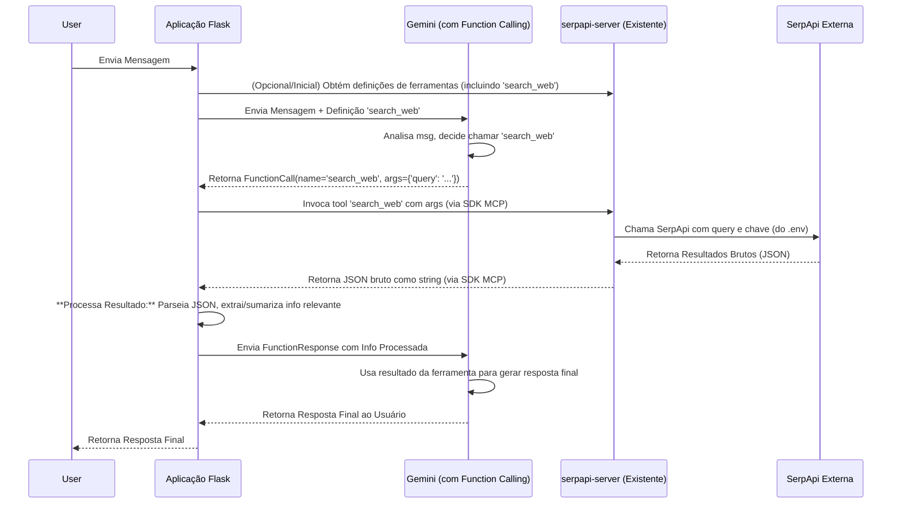

# Plano Detalhado: Integração de Busca Web via MCP e Function Calling

## 1. Objetivo Principal

Capacitar a IA (baseada em Flask/Gemini) a buscar informações atualizadas na web para:
*   Responder perguntas que exigem conhecimento recente.
*   Coletar dados relevantes para análise contextual.
*   Verificar fatos mencionados na conversa.

## 2. Componentes Envolvidos

*   **Aplicação Cliente:** Aplicação web Flask (Python) existente.
*   **Modelo de IA:** Google Gemini com suporte a Function Calling.
*   **Servidor MCP:** Servidor `serpapi-server` existente (Node.js/TypeScript) localizado em `C:\mcp_servers\serpapi-server`.
*   **API Externa:** SerpApi (para realizar as buscas na web).

## 3. Configuração da Chave API (SerpApi)

*   **Problema:** O servidor MCP `serpapi-server` atualmente espera a chave da API via variável de ambiente (`process.env.SERPAPI_API_KEY`), mas a chave está configurada no lado do cliente (Roo).
*   **Solução:** Modificar o `serpapi-server` para usar a biblioteca `dotenv` e ler a chave de um arquivo `.env` local dentro do diretório do servidor.
    *   Instalar `dotenv` (`npm install dotenv`).
    *   Adicionar `import 'dotenv/config';` no início de `src/index.ts`.
    *   Criar arquivo `.env` em `C:\mcp_servers\serpapi-server\` com o conteúdo: `SERPAPI_API_KEY=SUA_CHAVE_SERPAPI_AQUI`.
    *   Adicionar `.env` ao `.gitignore`.
    *   Recompilar o servidor (`npm run build`, se necessário).

## 4. Ferramenta MCP Utilizada

*   **Nome:** `search_web` (exposta pelo `serpapi-server`).
*   **Descrição:** "Realiza uma busca na web usando SerpApi."
*   **Input Schema:**
    ```json
    {
      "type": "object",
      "properties": {
        "query": {
          "type": "string",
          "description": "O termo de busca."
        }
      },
      "required": ["query"]
    }
    ```
*   **Output:** Retorna o JSON completo da resposta da SerpApi como uma string de texto.

## 5. Fluxo de Integração (MCP + Function Calling)



## 6. Implementação Detalhada

1.  **Modificar Servidor MCP:** Aplicar os passos da Seção 3 para configurar a leitura da chave API via `.env`.
2.  **Integrar Cliente MCP no Flask:**
    *   Usar o SDK do MCP (Python) para conectar ao `serpapi-server` (via stdio ou outro transporte configurado).
    *   Obter a definição da ferramenta `search_web`.
3.  **Adaptar `chat_api.py` (Flask):**
    *   Converter o schema da ferramenta MCP para o formato `google.generativeai.types.Tool`.
    *   Passar a definição da ferramenta ao chamar `gemini_model.generate_content`.
    *   Implementar a lógica para detectar `FunctionCall` para `search_web`.
    *   Chamar `mcp_session.call_tool('search_web', ...)` quando a chamada for detectada.
    *   Receber a string JSON da resposta.
    *   **Implementar lógica de processamento:** Parsear o JSON, extrair dados úteis (ex: `answer_box`, `organic_results[0].snippet`, etc.).
    *   Construir a `FunctionResponse` com os dados processados.
    *   Enviar a `FunctionResponse` de volta ao Gemini.
    *   Gerenciar a resposta final do Gemini.
4.  **Prompt Engineering:** Ajustar os prompts do Gemini (se necessário) para incentivar o uso eficaz da ferramenta `search_web`.
5.  **Testes:** Realizar testes end-to-end cobrindo diferentes cenários de busca.
6.  **Monitoramento:** Adicionar logging para chamadas MCP e processamento de resultados.

## 7. Próximos Passos

*   Executar os passos de modificação do servidor MCP.
*   Iniciar a implementação da integração no lado do cliente Flask.
*   (Sugerido) Mudar para o modo "Code" para realizar as modificações e implementações.